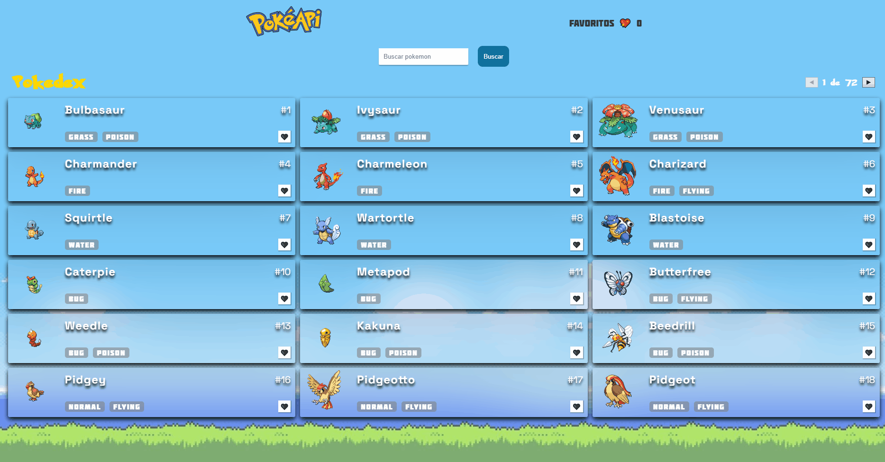
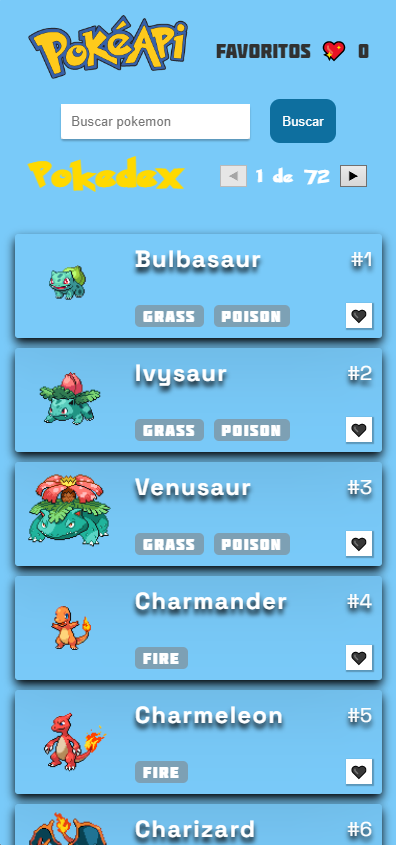

# Projeto Pokédex API

Este projeto foi inicializado com create react app, que consome a [PokéAPI](https://pokeapi.co)

## Índice

- [Visão geral](#visão-geral)
  - [Descrição](#descrição)
  - [Screenshot](#screenshot)
  - [Como usar](#como-usar)
  - [Links](#links)
- [Meu processo](#meu-processo)
  - [Tecnologias utilizadas](#tecnologias-utilizadas)
  - [Desenvolvimento](#desenvolvimento)
- [Autor](#autor)

## Visão geral

### Descrição

- O projeto "Pokedex API" é uma aplicação web desenvolvida em React que utiliza a API PokéAPI para buscar informações sobre pokémons e exibi-las na tela. A aplicação permite que o usuário pesquise por um Pokémon específico, navegando através de uma lista. Cada Pokémon exibe informações básicas, como nome, número, tipo e imagem.  O aplicativo também apresenta uma opção de favoritos, na qual o usuário pode salvar seus Pokémons favoritos 

### Screenshot

#### Desktop

#### Mobile

### Como usar

No diretório do projeto, você pode executar:

### `npm install`
Executa a instalação dos pacotes dependentes do projeto

### `npm start`

Executa o aplicativo no modo de desenvolvimento. 

Abra http://localhost:3000 para visualizá-lo no navegador.

A página será recarregada se você fizer edições. Você também verá erros de lint no console.

### `npm test`

Inicia o executor de teste no modo de observação interativo. Consulte a seção sobre como [executar testes](https://create-react-app.dev/docs/running-tests/) para obter mais informações.

### `npm run build`
Cria o aplicativo para produção na build pasta. Ele empacota corretamente o React no modo de produção e otimiza a compilação para obter o melhor desempenho.

A compilação é minificada e os nomes dos arquivos incluem os hashes. Se necessário, nomes de classe e nomes de função podem ser ativados para fins de criação de perfil. Consulte a seção de [compilação de produção](https://create-react-app.dev/docs/production-build/) para obter mais informações.

Seu aplicativo está pronto para ser implantado! Consulte a seção sobre [implantação](https://create-react-app.dev/docs/deployment/) para obter mais informações sobre como implantar seu aplicativo em provedores de hospedagem populares.

### `npm run eject`
Nota: esta é uma operação unidirecional. Uma vez que você eject, você não pode voltar atrás!

Se você não estiver satisfeito com a ferramenta de compilação e as opções de configuração, poderá fazê-lo ejecta qualquer momento. Este comando removerá a dependência de compilação única do seu projeto.

Em vez disso, ele copiará todos os arquivos de configuração e as dependências transitivas (webpack, Babel, ESLint, etc.) para o seu projeto como dependências em package.json. Tecnicamente, a distinção entre dependências e dependências de desenvolvimento é bastante arbitrária para aplicativos front-end que produzem pacotes estáticos.

Além disso, costumava causar problemas com algumas plataformas de hospedagem que não instalavam dependências de desenvolvimento (e, portanto, não conseguiam compilar o projeto no servidor ou testá-lo logo antes da implantação). Você é livre para reorganizar suas dependências package.json como achar melhor.

Todos os comandos, exceto eject, ainda funcionarão, mas eles apontarão para os scripts copiados para que você possa ajustá-los. Neste ponto você está por conta própria.

Você não precisa nunca usar eject. O conjunto de recursos com curadoria é adequado para implantações pequenas e médias, e você não deve se sentir obrigado a usar esse recurso. No entanto, entendemos que esta ferramenta não seria útil se você não pudesse personalizá-la quando estivesse pronto para ela.

### Links

- URL da documentação: [create react app](https://create-react-app.dev/docs/available-scripts#npm-start)

- URL da página: [Pokedex API](https://alexjr53.github.io/pokedex-api/)

- URL do Repositório: [Pokedex API](https://github.com/Alexjr53/pokedex-api)

## Meu processo

### Tecnologias utilizadas

- HTML
- CSS
- Javascript
- React

### Desenvolvimento

#### Funcionalidades Futuras

- Exibição de detalhes de cada Pokémon. 
    Em breve, será adicionada uma nova funcionalidade que permitirá ao usuário ver detalhes adicionais de cada Pokémon ao clicar em sua imagem na lista. Os detalhes adicionais incluirão a descrição do Pokémon, bem como seu tipo.

- Pesquisa avançada de Pokémon 
Também será adicionada uma nova funcionalidade que permitirá ao usuário realizar uma pesquisa avançada de Pokémon. A pesquisa avançada incluirá opções para filtrar os Pokémons por tipo, habilidades. O resultado da pesquisa será exibido em uma nova página, onde o usuário poderá visualizar os Pokémons que correspondem aos critérios de pesquisa.

- Visualização de Pokémons favoritos 
permitirá ao usuário visualizar os Pokémons que foram salvos como favoritos. O usuário poderá acessar uma lista de Pokémons favoritos que será armazenada localmente e poderá visualizar os detalhes de cada um desses Pokémons.

## Autor
Alexsandro rosa junior

- GitHub - [Alexjr53](https://github.com/Alexjr53)
